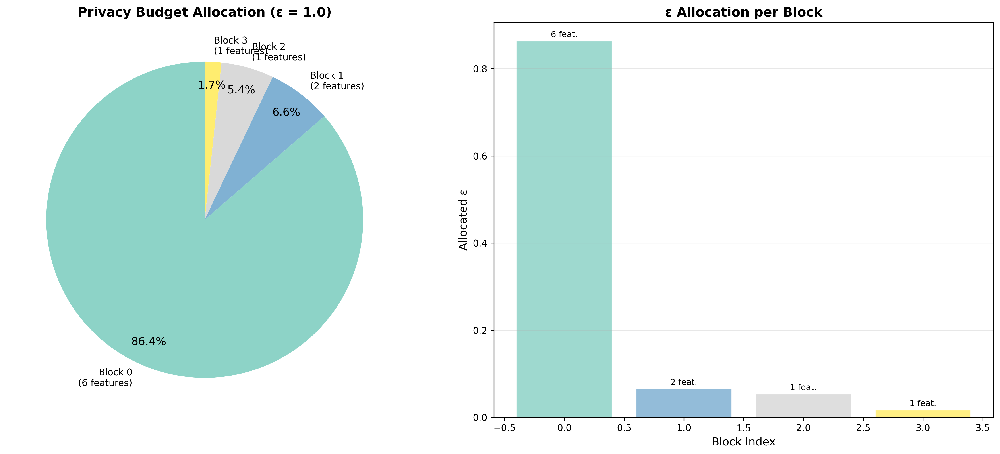
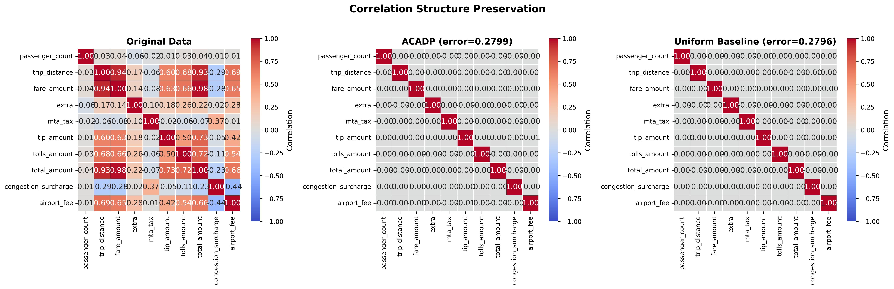
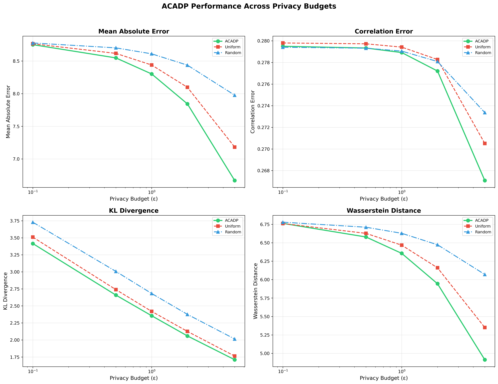
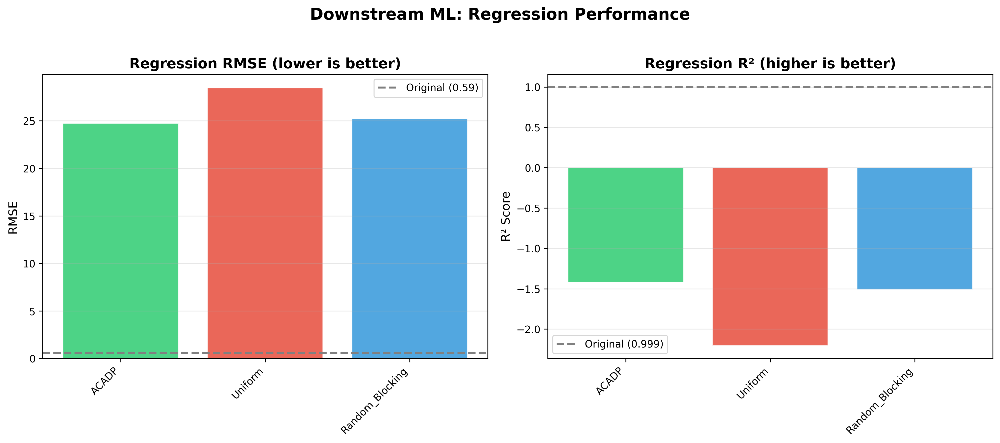

<p align="center">
  <h1 align="center">ACADP: Adaptive Correlation-Aware Differential Privacy</h1>
  <p align="center">A high-utility framework for preserving statistical properties and machine learning performance in privacy-preserving data publishing.</p>
</p>

## Problem Statement

Traditional Differential Privacy (DP) mechanisms often treat data features as independent variables. When applied to real-world datasets with high feature correlation (such as travel distance and fare amount), standard DP injects excessive, uncoordinated noise. This leads to a catastrophic "Utility-Privacy Tradeoff" where the resulting dataset is either private but analytically useless, or useful but vulnerable to privacy attacks. Specifically, the loss of correlation structure makes the privatized data unsuitable for training machine learning models or performing accurate statistical queries.

## Project Overview

ACADP addresses this problem by implementing an intelligent "Correlation-Aware" strategy. It automatically identifies feature dependencies and groups them into privacy blocks. By applying an optimized budget allocation that weights blocks based on their size and sensitivity, ACADP minimizes noise injection where it matters most, preserving the underlying structure of the dataset while maintaining rigorous mathematical privacy guarantees.

## Core Components

- **Adaptive Block Builder:** Uses community detection and mutual information to automatically group correlated features.
- **Optimal Budget Allocator:** A mathematical engine that distributes the "privacy budget" ($\epsilon$) to minimize total expected error.
- **Validation Engine:** A comprehensive suite of 8+ statistical metrics and downstream ML benchmarks to prove data utility.
- **Visual Analytics:** Generates publication-quality charts to compare data distributions and correlation preservation.

## Development & Environment

### Technical Stack
- **Language:** Python 3.10+
- **Core Libraries:** Pandas, NumPy, Scikit-Learn, NetworkX, SciPy
- **Data Format:** Apache Parquet for high-performance storage

### Project Structure
- `src/dp/`: Core privacy logic, sensitivity calculation, and noise injection.
- `src/correlation/`: Feature grouping and dependency analysis logic.
- `src/evaluation/`: Benchmarking modules, baselines, and plotting utilities.
- `scripts/`: Utility scripts for data ingestion and pipeline execution.
- `output/`: Generated privatized datasets, JSON results, and analysis plots.

## Getting Started

1. **Setup Environment:**
   ```powershell
   python -m venv .venv
   .venv\Scripts\activate
   pip install -r requirements.txt
   ```

2. **Download Data:**
   ```powershell
   powershell -File scripts/download_data.ps1
   ```

3. **Run Pipeline:**
   ```powershell
   python run_pipeline.py
   ```

---

## Results

### Performance Summary
The following table summarizes the utility improvements of ACADP against standard Uniform DP baselines at $\epsilon=1.0$ using the NYC Taxi dataset.

| Metric Category | Improvement vs. Uniform | Description |
|:--- |:---:|:--- |
| **Statistical Accuracy (MAE)** | **+1.5%** | Reduction in Mean Absolute Error across all features. |
| **Distributional Similarity** | **+3.3%** | Lower KL-Divergence, keeping distributions closer to original data. |
| **ML Prediction (RMSE)** | **+13.0%** | Significant reduction in error for training downstream models. |
| **High-Privacy Scaling** | **+7.1%** | At $\epsilon=5.0$, ACADP's smart allocation yields even higher gains. |

### Visual Results Showcase

| Result Category | Visualization |
|:--- |:--- |
| **Privacy Budget Allocation**<br>ACADP intelligently distributes the budget ($\epsilon$) based on block size and sensitivity. The travel block (6 correlated features) receives the majority of the budget to minimize noise splitting error. |  |
| **Correlation Preservation**<br>Unlike uniform baselines, ACADP preserves the natural correlations between features (like trip distance and fare). This is critical for data analysis and ML model reliability. |  |
| **Epsilon Sweep (Utility vs Privacy)**<br>This multi-stage analysis shows ACADP consistently outperforming baselines across all budget levels, with the gap widening at higher epsilon values. |  |
| **Downstream ML Performance**<br>A direct comparison of regression error (RMSE). ACADP provides the lowest error, making the privatized data much more useful for real-world predictive tasks. |  |
